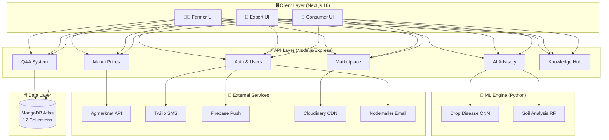
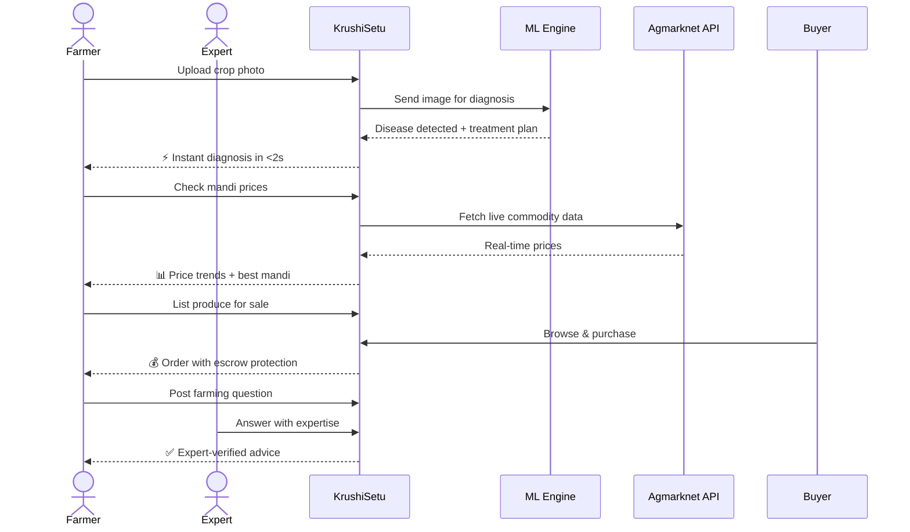
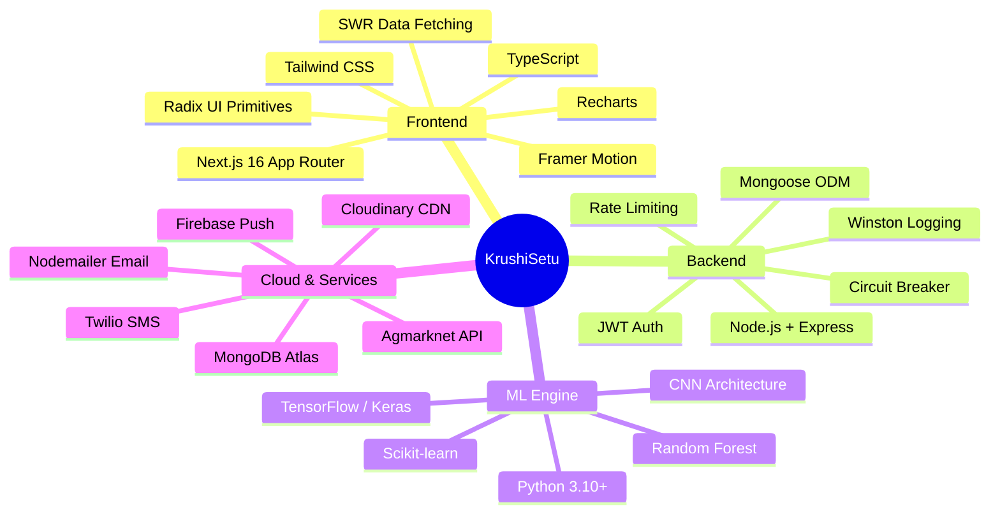
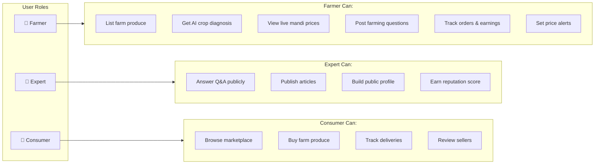
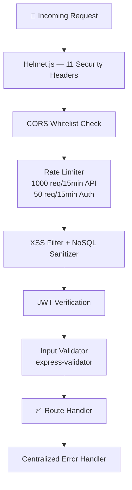
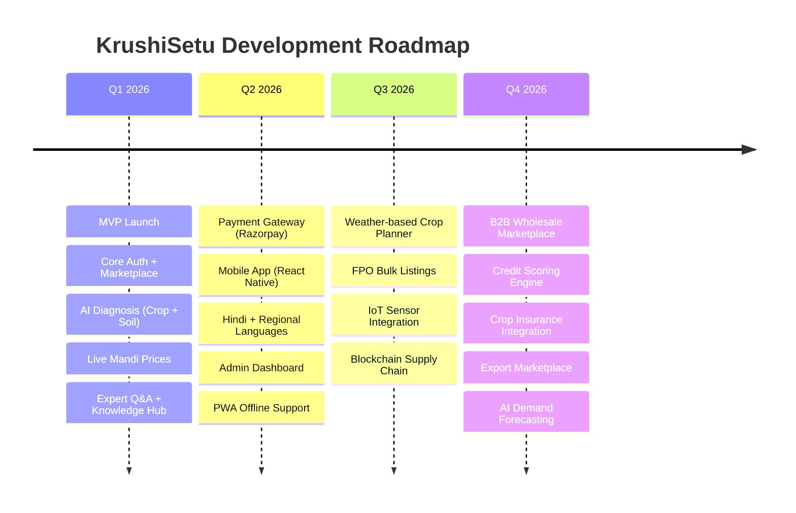

<div align="center">


<br/>

[](https://nextjs.org/)
[](https://nodejs.org/)
[](https://mongodb.com/)
[](https://python.org/)
[](https://typescriptlang.org/)
[](LICENSE)

<br/>

> **🌾 Empowering Indian Farmers with AI, Real-Time Market Intelligence & Expert Advisory**

[🚀 Live Demo](#) · [📖 Full Docs](PROJECT.md) · [🐛 Report Bug](https://github.com/Harsh-1165/KrushiSetu/issues) · [⭐ Star this repo](#)

<br/>


[](https://github.com/Harsh-1165/KrushiSetu/stargazers)
[](https://github.com/Harsh-1165/KrushiSetu/fork)

</div>

---

## 🧭 The Problem We're Solving

```
Indian farmers lose ₹92,651 Crore annually due to:
┌────────────────────────────────────────────────────────────┐
│  🔴 Middlemen taking 40-60% of actual sale price           │
│  🔴 35% crop loss due to undetected diseases               │  
│  🔴 No access to real-time mandi prices before harvest     │
│  🔴 Agricultural experts unreachable in rural areas        │
│  🔴 Information asymmetry exploited by traders             │
└────────────────────────────────────────────────────────────┘

KrushiSetu fixes ALL of this in ONE platform.
```

---

## 🗺️ Platform Architecture



---

## 🔄 User Journey Flow



---

## ✨ Feature Showcase

<table>
<tr>
<td align="center" width="25%">

### 🤖 AI Diagnosis
**Instant** crop & soil disease detection using custom-trained CNN models.
Upload a photo → get diagnosis + treatment in **under 2 seconds**.

`TensorFlow` `Scikit-learn` `Python`

</td>
<td align="center" width="25%">

### 📊 Live Mandi Prices
Real-time commodity prices from **Agmarknet** with trend charts, price predictions and **custom SMS alerts**.

`Recharts` `Agmarknet API` `Twilio`

</td>
<td align="center" width="25%">

### 🛒 Marketplace
Escrow-protected direct farm produce sales. **No middlemen.** GPS-based product discovery.

`MongoDB` `Cloudinary` `Express`

</td>
<td align="center" width="25%">

### 👨‍🔬 Expert Network
Verified agronomists answer farmer questions. Knowledge Hub with articles, guides & crop tips.

`Q&A Engine` `Rich Editor` `Ratings`

</td>
</tr>
</table>

---

## 🏗️ Tech Stack Breakdown



---

## 📊 Impact by the Numbers

<div align="center">

| 🌾 | 📈 | 🤖 | ⚡ | 🔒 |
|:---:|:---:|:---:|:---:|:---:|
| **50,000+** | **+35%** | **2M+** | **<200ms** | **A Grade** |
| Farmers Targeted | Avg Yield Gain | AI Diagnoses/yr | API Response | Security Rating |

</div>

---

## 🔐 Multi-Role Access System



---

## 🗄️ Data Architecture

```
MongoDB Atlas — 17 Collections
├── 🔐 Auth Layer
│   ├── users         → All roles: farmer/expert/consumer
│   └── tokens        → JWT refresh token rotation
│
├── 🛒 Marketplace Layer
│   ├── products      → Listings + inventory + location
│   ├── orders        → Full order lifecycle + escrow
│   ├── cart          → Session cart state
│   └── reviews       → Verified purchase-only reviews
│
├── 🌾 Advisory Layer
│   ├── questions     → Farmer Q posts
│   ├── answers       → Expert responses + votes
│   ├── articles      → Knowledge Hub content
│   ├── comments      → Article discussion
│   └── cropadvisories→ AI diagnosis history per user
│
├── 📊 Market Layer
│   ├── mandis        → Mandi master data + GPS
│   ├── mandiprices   → Time-series commodity prices
│   └── pricealerts   → User-defined price triggers
│
└── 📱 Engagement Layer
    ├── notifications  → In-app notification feed
    ├── aifeedback     → AI response quality tracking
    └── searchhistory  → Search analytics per user
```

---

## 🔒 Security Architecture



---

## 🚀 Quick Start

```bash
# 1. Clone
git clone https://github.com/Harsh-1165/KrushiSetu.git
cd KrushiSetu

# 2. Install all dependencies
npm install && cd backend && npm install && cd ..

# 3. Install Python ML dependencies
pip install -r backend/ml/requirements.txt

# 4. Set up environment (copy and fill these files)
cp .env.local.example .env.local       # frontend config
cp backend/.env.example backend/.env   # backend config

# 5. Run
# Terminal 1 — Backend
cd backend && node server

# Terminal 2 — Frontend  
npm run dev

# 🎉 Open http://localhost:3000
```

---

## 📁 Repository Structure

```
KrushiSetu/
│
├── 🖥️  app/                          # Next.js App Router
│   ├── (auth)/                       # Auth pages: login, signup, reset
│   ├── (dashboard)/dashboard/        # 16 role-based dashboard sections
│   ├── marketplace/                  # Product listing, cart & checkout
│   └── knowledge-hub/                # Articles, categories, write
│
├── 🧩  components/                   # 57+ reusable UI components
│   ├── ui/                           # Radix-based primitives
│   ├── dashboard/                    # Dashboard-specific widgets
│   ├── ai/                           # AI advisory components
│   └── knowledge-hub/                # Article cards, reader progress
│
├── ⚡  backend/
│   ├── routes/                       # 14 API route modules
│   ├── models/                       # 17 Mongoose schemas
│   ├── services/                     # Email, SMS, Push, AI, Weather
│   ├── middleware/                   # Auth, CORS, Rate Limit, Validate
│   ├── ml/                           # Python ML: predict.py, train.py
│   └── utils/                        # Logger, AppError, CircuitBreaker
│
└── 📚  lib/                          # API clients & TypeScript utils
```

---

## 🛣️ Roadmap



---

## 🤝 Contributing

We welcome contributions! Here's how to get started:

1. **Fork** the repository
2. **Create** a feature branch: `git checkout -b feature/amazing-feature`
3. **Commit**: `git commit -m 'feat: add amazing feature'`
4. **Push**: `git push origin feature/amazing-feature`
5. **Open** a Pull Request

Please follow [Conventional Commits](https://www.conventionalcommits.org/) for commit messages.

---

## 📄 License

Distributed under the **MIT License** — free for personal and commercial use.

---

<div align="center">

### Built for India's 140 Million Farming Families 🌾

*"KrushiSetu — Bridge between farmers and the future"*

**⭐ Star this repo if it inspires you!**

[](https://github.com/Harsh-1165/KrushiSetu/stargazers)

Made with ❤️ by [Harsh](https://github.com/Harsh-1165)

</div>
